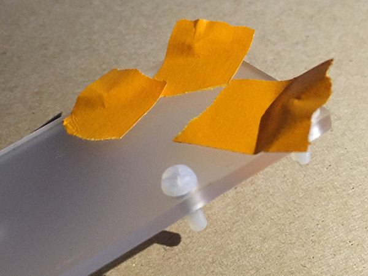
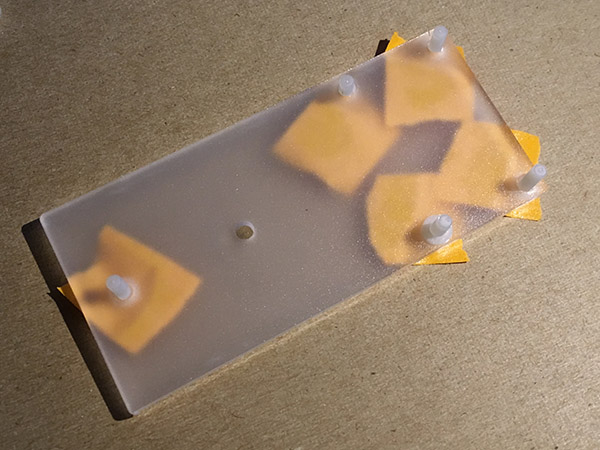
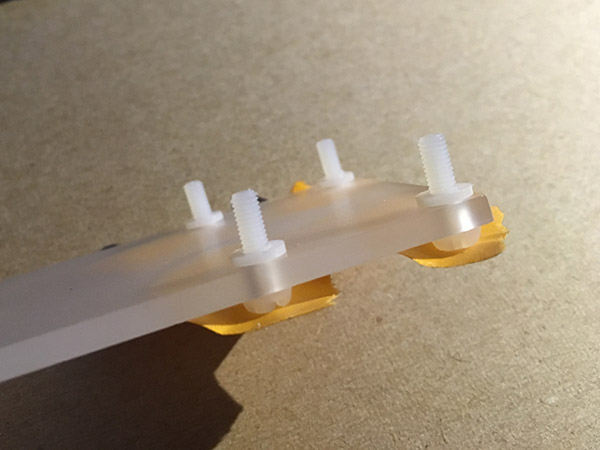
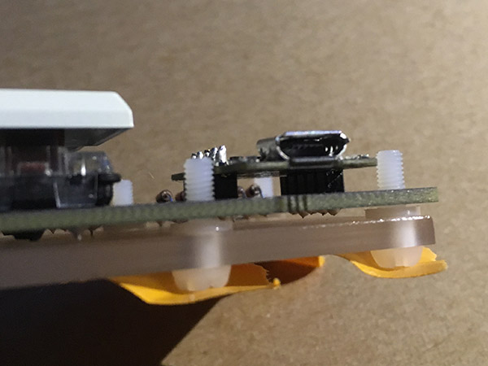
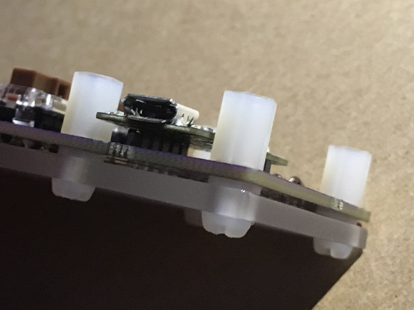
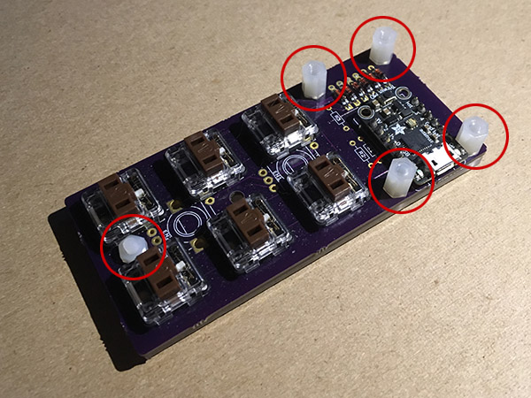
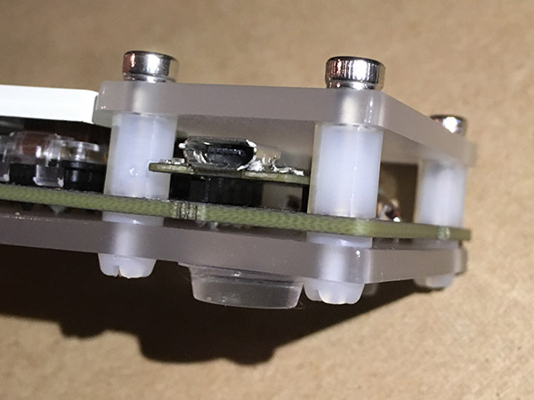

## Enclosure

The MiniKbd doesn't need to be built in an enclosure, but at minumum I would highly suggest at least getting a set of small rubber bumper feet for the bottom so that it stays put and doesn't scratch up your desk. [Adafruit has a set of four](https://www.adafruit.com/product/550) if you're already ordering from them, as well as [Kiwi Electronics](https://www.kiwi-electronics.nl/siliconen-voetjes-voor-behuizingen-4-stuks) in The Netherlands, but I prefer the [3M SJ5312 Bumpon](https://www.amazon.com/gp/product/B000NG60SW/ref=oh_aui_detailpage_o00_s00?ie=UTF8&psc=1) because they're very small and grippy.

For the enclosure, I've laser cut parts in 1/8 inch (3mm) acrylic sheet, which can be avaialble from many sources. Files are available this directory. You won't want to completely obscure the LEDs on the top of the Trinket so I would recommend translucent acrylic if available. I like using the [Frosted Satin Ice](https://www.canalplastic.com/collections/plexi-sheets/products/0d010-df-frosted-satin-ice-acrylic-sheet?variant=32918342606) that I buy at Canal Plastics in NYC, but I would encourage you to look for local options. Laser cutting might also be able to be ordered from [Ponoko](https://www.ponoko.com/).

In addition to the laser cut acrylic parts and the rubber bumper feet, you will also need:
- 4 × 8mm long M3 sized standoffs
- 5 × M3x8mm or 10mm screws
- 4 × M3x6mm screws
- 1 × M3 nut
- 5 × M3x1mm washers

Amazon and Ebay seem to be good places to buy these parts resonable price, I bought the [white Nylon m3 standoff assortment](https://www.amazon.com/gp/product/B01DK3905Y/ref=oh_aui_detailpage_o00_s00?ie=UTF8&psc=1) which is also available in [black](https://www.amazon.com/gp/product/B01E8JZWZ6/ref=ox_sc_sfl_title_14?ie=UTF8&psc=1&smid=A1Z1DJFHECM1GS), along with a small set of [M3 1mm nylon washers](https://www.amazon.com/gp/product/B01N45UFLG/ref=oh_aui_detailpage_o01_s00?ie=UTF8&psc=1). You can go nuts and get the same [stainless hex screws](https://www.amazon.com/gp/product/B01M3SFIAZ/ref=oh_aui_detailpage_o01_s00?ie=UTF8&psc=1) that I used for the top four screws of the enclosure.

The set of nylon hardware that I've linked to above only has 10mm long screws which will be too long, but you can very easily clip 2mm or so off of the screws that you use on the top of the enclosure.

#### Build guide

Start with the bottom piece of the enclosure. Feed the five longer screws through, and temporarily cover the screw heads with tape.

Flip the bottom over so that the tape and screw heads are facing down (good thing the tape is holding it all together for now).

Place the 1mm washers on all five screws. This will keep the MiniKbd circuit board spaced just slightly off of the enclosure, which should be enough room for the solder joints on the bottom of the board to keep from pressing down unevenly.

Keeping everything together, feed the MiniKbd circuit board on to the five screws and washers.

Screw on the four spacers. You can start by tightening them by hand, then once the screw is started you can remove the tape and finish screwing them on. No need to over-tighten!

Attach the nut to the fifth screw on the other end of the board. You might need a set of pliers to hold the nut while you attach the screw, or you might be able to just hold the nut by presing straight down with a finger.

Finish by attaching the top enclosure piece with four shorter screws. This photo shows the full stack up with some nice nickel plated screws for the top, but the nylon screws will work just fine too.

